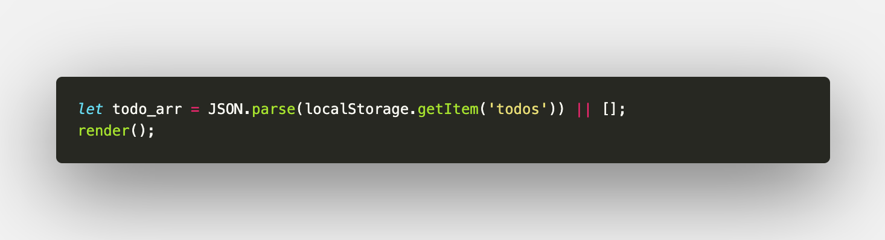
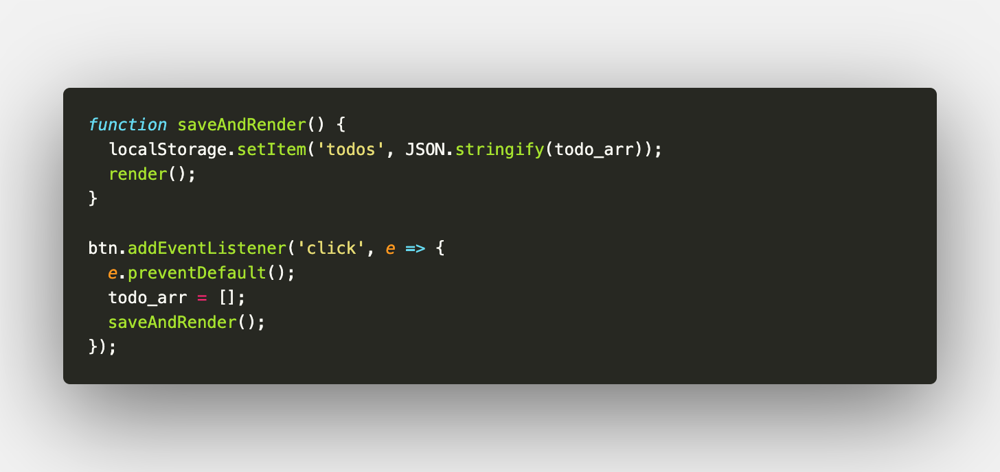
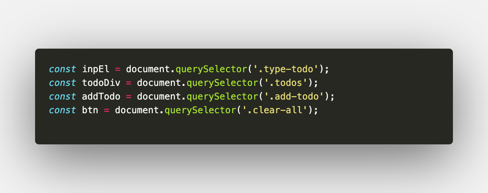

# Todo List App

Hey, guys I am just a beginner started learning _HTML_,_CSS_ and _Javascript_ no more than three months. Somehow managed to build the so-called "**_Todo List App_**".

# Document Flow

- UI Components
- Features
- Architecture

  - Global State

  - Flow

  - Event Handlers

- Resources
- Inspiration
- Feedback

So let's get started!

# UI Components

> Header

- Header with a title _*Todos*_

> Input Element

- Input tag with necessary attributes for entering _todo_

> Buttons

- Two buttons: One for adding a todo and another button for clearing all the todos from the localStorage.

> Todo Element

- Todo Element will contain the todo with a checkbox, edit icon and delete icon.

> Footer

- Footer is fixed at the bottom of the page.

# Features

> CRUD Operations

- Creating a new todo.
- Reading the todos.
- Updating the respective todo when the edit icon is clicked.
- Deleting the respective todo when the delete icon is clicked.

# Architecture

> ## Global State

- Here the global array is the **Single State Of Truth** because all the functions are dependant on the `todo_arr` global variable.
- There are two states for the `todo_arr`:

1. State One

- When the localStorage is cleared the `todo_arr` should be explicitly set to `[]`.
- But this does not solve our problem with the DOM since we clear all the todos in the localStorage the `todo_arr`
  state only gets updated in the localStorage...
- So before we call the `render()` we update the `todo_arr` to `[]`.

2. State Two

- The localStorage will be updated with todos based on the features in our app.
- So, when the user deletes/updates a todo, the particular todo will be deleted/updated from the `todo_arr`.
- Now we populate the deleted/updated todos in the `todo_arr` as well as the localStorage.

> ## Flow of the Application

1. Select the required elements from the HTML using the `document.querySelector`.

2. Add `eventListener` to `inpEl`, `btn`, `addTodo`, delete icon and update icon.

3. Now create `eventHandler` functions for all the `eventListener` elements.

> ## Event Handlers

1. We have to create the `eventHandler` functions based on the application features.
2. Since we implement CRUD operation in this application we create the respective `eventHandler` functions for the respective features of the application.
3. Additionally, we add another eventListener to track the status of the todo whether the todo task is completed or not.

# Resources

1. [Level Up Tuts](https://www.youtube.com/user/LevelUpTuts)
2. [enlight](https://enlight.nyc/projects/to-do/)
3. [w3schools](https://www.w3schools.com/howto/howto_js_todolist.asp)
4. [dribble](https://dribbble.com/tags/todo_list)

# Inspiration

1. I was inspired by the way many developers around the world who commit themselves to build small/large frontend applications to improve their skill or to get a job.

2. In my case, it is to get a job.

# Feedback and Contact

> ## **If you feel something is wrong in the code and there are some aspects of this project that can be improved feel free to contact me**:

### 1. [Twitter](https://twitter.com/Rohit_Noob_Dev)

### 2. [linkedIn](https://www.linkedin.com/in/rohit-s-5b1a13137/)
